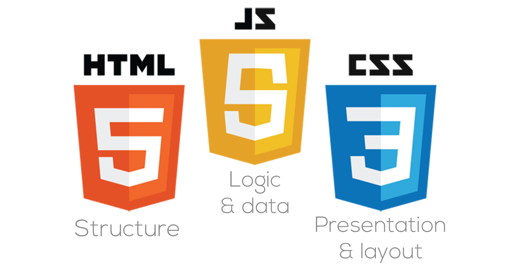

# Files for HTTP-5122
## Course: Front-End Web Development
### Course Code: HTTP 5122

### Academic Year: 2024-2025

This course provides an introduction to the basics of computer programming and equips students with the tools necessary to create interactive web pages utilizing the JavaScript programming language.

## Useful Links
- [JavaScript Tutorial by W3Schools](https://www.w3schools.com/js/default.asp)

## Visual Reference


> **Important Notice:** This repository contains my weekly assignments for this course. Regular practice with JavaScript is recommended to improve your coding skills and build confidence.

## Example Code

Here’s a simple JavaScript function to assess the current temperature:

```javascript
function checkTemp(currentTemp) {
    if (currentTemp > 30 || currentTemp < -10) {
        return false;
    } else {
        return true;
    }
}

var askTemp = prompt("Please enter the current temperature:");
if (checkTemp(askTemp) === true) {
    alert("You're all set, enjoy your walk!");
} else {
    alert("Oh no! This isn't suitable weather for walking a dog!");
}
